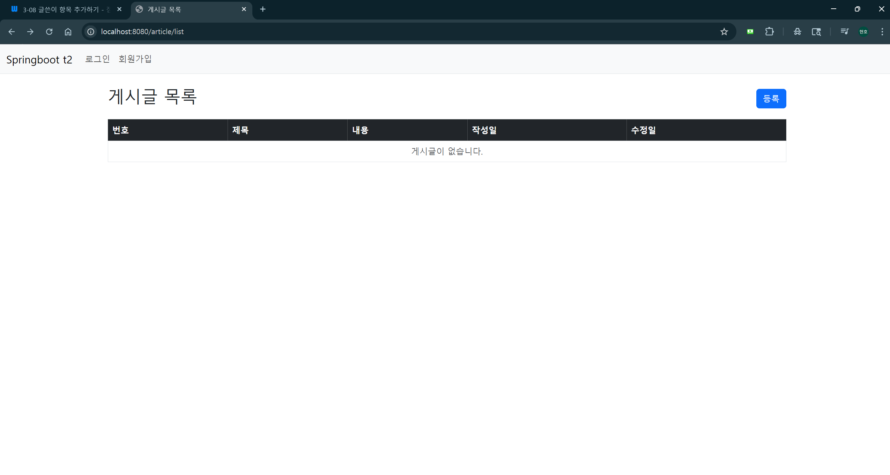
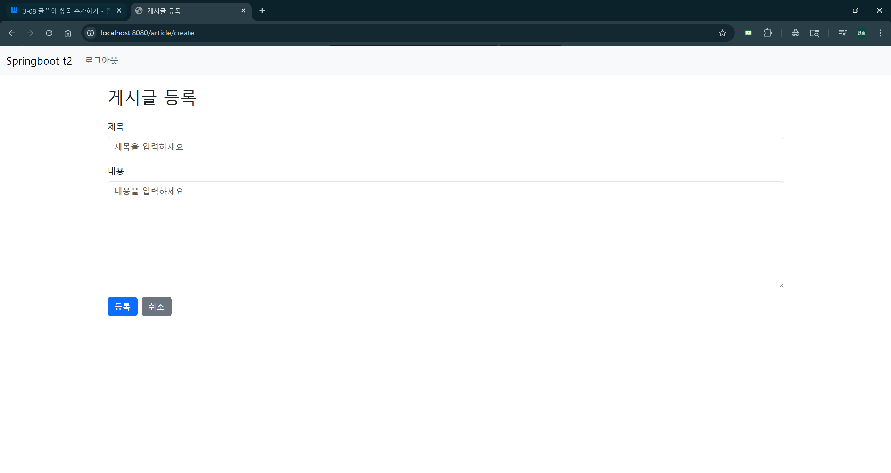
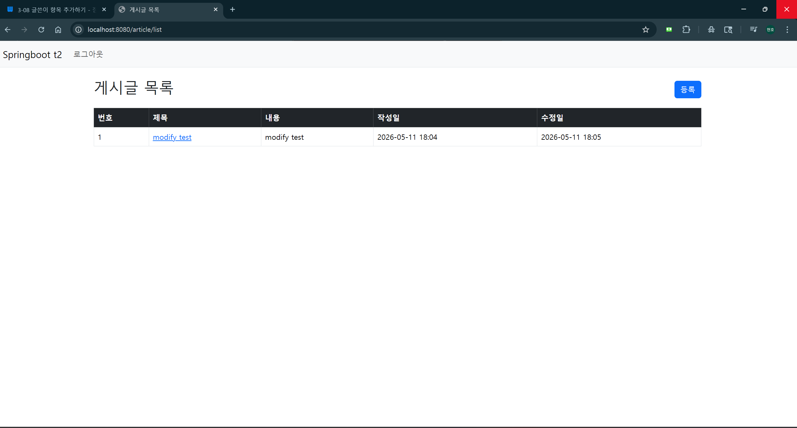
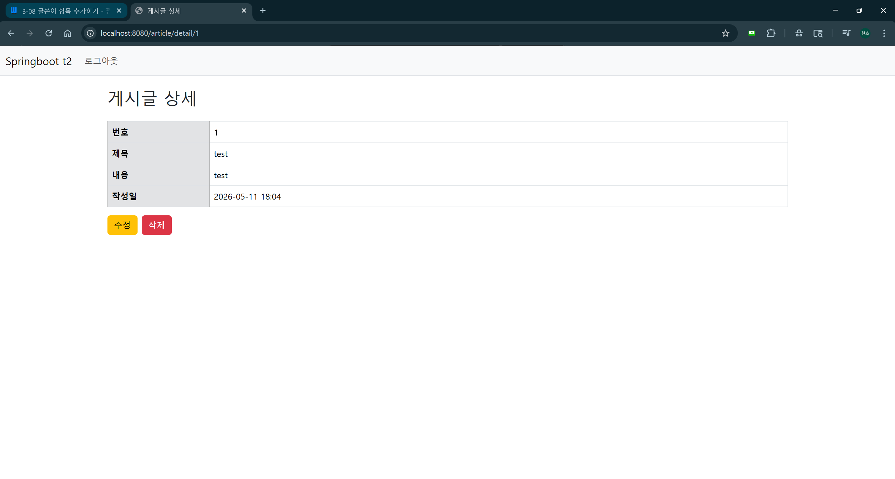
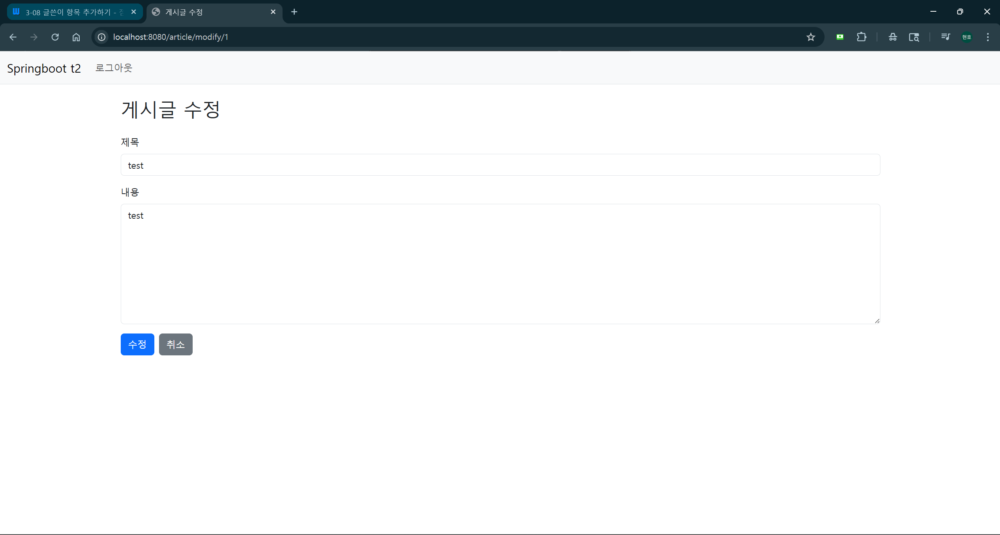
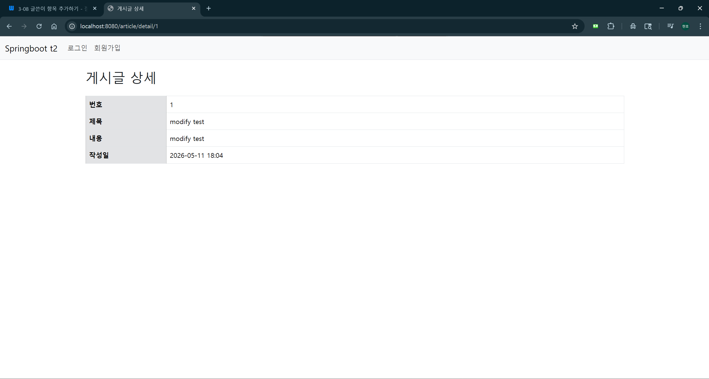
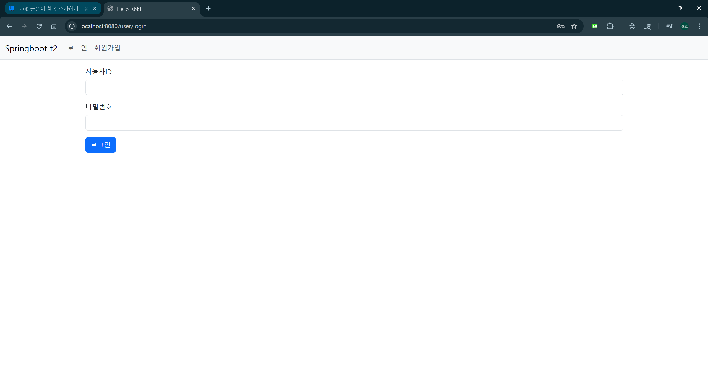
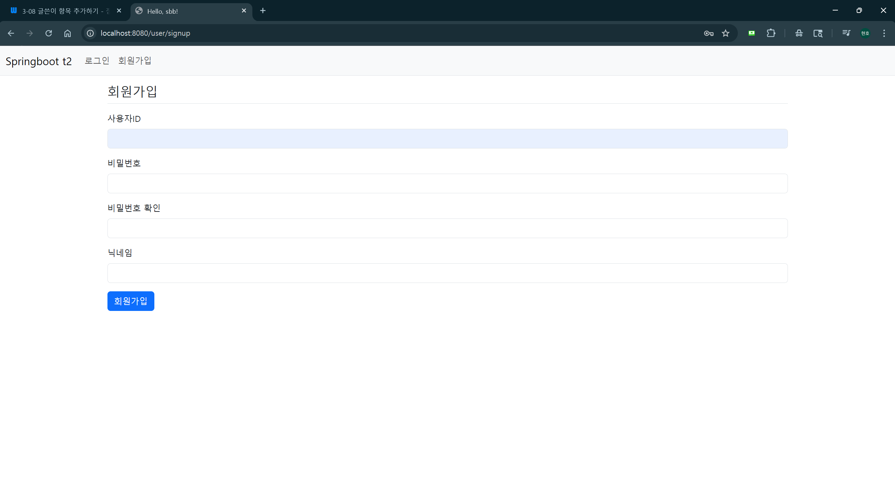

## 1차 요구사항 구현

- [x] 유저가 루트 url로 접속시에 게시글 리스트 페이지(http://주소:포트/article/list)가 나온다.
- [x] 리스트 페이지에서는 등록 버튼이 있고 버튼을 누르면 http://주소:포트/article/create 경로로 이동하고 등록 폼이 나온다.
- [x] 게시글 등록을 하면 http://주소:포트/article/create로 POST 요청을 보내어 DB에 해당 내용을 저장한다.
- [x] 게시글 등록이 되면 해당 게시글 리스트 페이지로 리다이렉트 된다. 페이지 URL 은 http://주소:포트/article/list 이다.
- [x] 리스트 페이지에서 해당 게시글을 클릭하면 상세페이지로 이동한다. 해당 경로는 http://주소:포트/article/detail/{id} 가 된다.
- [x] 게시글 상세 페이지에는 목록 버튼이 있다. 목록 버튼을 누르면 게시글 리스트 페이지로 이동하게 된다.

# 2차 요구사항

- [x] 게시글 상세페이지(http://주소:포트/article/detail/{id})에 수정 버튼이 있다. 수정 버튼을 누르면 게시글을 수정 할 수 있는 폼이나 오고 수정이 가능하다.
- [x] 게시글 상세페이지에 삭제 버튼이 있다. 삭제 버튼을 누르면 게시글이 삭제가 된다. 삭제 후 리스트 페이지로 리다이렉트 된다.
- [x] 모든 페이지 상단에 루트 디렉토리로 이동하는 버튼이 있다.(예: 로고)
- [x] 모든 페이지 상단에 로그인 상태 표시하는 버튼이 있다.(예: 로그인 / 로그아웃)
- [x] 모든 페이지 회원가입 버튼이 있다. 버튼을 누르면 회원가입 폼으로 이동한다.
    - [x] 회원가입 폼은 유저ID, 닉네임, 비밀번호, 비밀번호 확인으로 구성된다. 회원가입 버튼을 누르면 데이터 검증 후 회원가입이 된다.
- [x] 로그인 버튼을 누르면 로그인 폼으로 이동한다.
    - [x] 로그인 페이지는 사용자 유저ID과 비밀번호를 입력하는 폼으로 구성되고 로그인 버튼을 누르면 데이터 검증 후 로그인이 된다.
- [x] 로그아웃 버튼을 누르면 로그아웃이 된다.
- [x] 유저가 게시글 작성 및 수정 접근시 로그인 여부를 검사하고 본인 글에 대해서만 수정 / 삭제가 가능하다.
- [x] (선택)메인페이지에 검색 기능이 구현되어야 한다. input 박스에 내용을 적고 검색 버튼을 누르면 해당 문자가 포함된 게시글이 리스트업 되어야 한다.
  본인 글에 대해서만 수정 / 삭제가 가능하다.

## 미비(선택)사항 or 막힌 부분

- Spring Security 설정 과정에서 인증/인가 흐름을 이해하는 데 어려움이 있었다.
  URL 기반 접근 제어(`SecurityConfig`)와 메서드 레벨 권한 검증(`ResponseStatusException`)을
  함께 적용하는 방식을 학습하면서 해결하였다.
- 게시글 수정/삭제 시 작성자 본인 여부를 검증하는 로직 구현 과정에서
  `Principal`을 통해 현재 로그인 유저를 가져오고 `Article`의 `author` 필드와
  비교하는 방식을 익히는 데 시간이 걸렸다.
- Thymeleaf 문법에 대한 이해도가 부족하여 `th:if`, `sec:authorize`, `#authentication` 등
  Spring Security와 연동되는 표현식을 템플릿에 적용하는 부분에서 어려움이 있었다.

## UI/UX (화면 캡처본을 복사 붙여 넣기, url 주소 나오도록)

- 게시글 리스트 페이지
  
- 게시글 등록 폼 페이지
  
  (수정시 날짜 변경)
  
- 게시글 상세 페이지
  
  (수정페이지)
  
  (권한이 없는 사용자)
  
- 로그인 페이지
  
- 회원가입 페이지
  
- (선택) 검색 페이지
